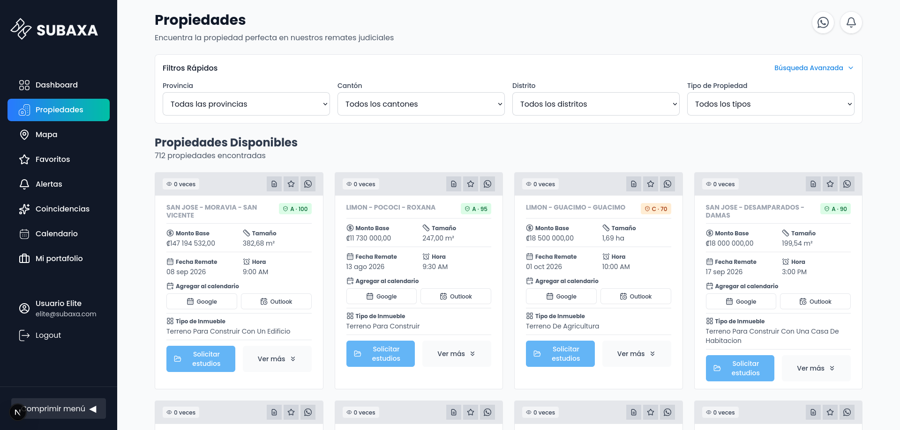
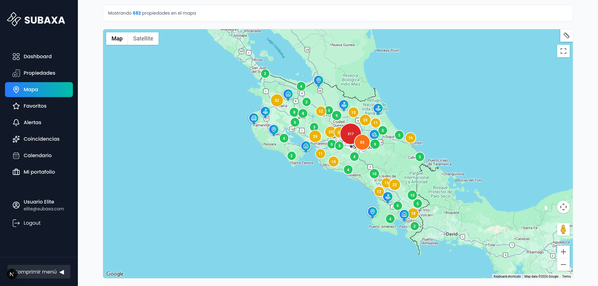

I come from a technology services background. For most of my career, I've worked on solving other people's technology problems.

In many cases, I'm proud of what we achieved. We built products, modernized businesses, and solved difficult technical challenges. But no matter how rewarding those projects were, they always belonged to someone else.

I've been building things for as long as I can remember. First with LEGO, then with wood, and later, after learning to program in college, with software. Since then, I've dedicated my career to learning how to build better systems and better products.

For years, I dreamed of building something of my own.

I tried two or three times. Technically, those projects were often successful; some of them were even very good. But I was missing one of the most important ingredients for building a company: a meaningful problem worth solving.

> Technology alone isn't enough. Great companies solve real problems.

That's why I started <a href="https://subaxa.com/en/?utm_source=crojasaragonez.github.io&utm_medium=blog&utm_campaign=why-i-started-subaxa&referrer=https%3A%2F%2Fcrojasaragonez.github.io%2Fblog%2Fwhy-i-started-subaxa%2F" target="_blank" rel="noopener">Subaxa</a>.

The first version of the company was built with a different team. At the time, we didn't have a clear business model, and eventually we all agreed to stop working on it. There was no dramatic ending; it simply faded away.

A few years later, several things came together at exactly the right time:

1. The problem was still worth solving.
2. We had a new team with fresh ideas and complementary skills.
3. Through my co-founders, we had deep knowledge of judicial auctions.
4. We had a clear and sustainable business model.
5. We had the technology to build and iterate on software products quickly.

Suddenly, what had once been just an idea had all the ingredients to become a real business.

---

## The Problem We're Solving

Judicial auctions represent one of the most overlooked investment opportunities.

It's possible to purchase properties for a fraction of their market value, **sometimes as low as 20%**. But before Subaxa, only a small number of people had the time, experience, and legal knowledge required to read hundreds of pages of court documents to identify the few truly valuable opportunities.

Finding a good opportunity is only the beginning.

How do you evaluate the legal risks? How do you perform proper due diligence? How do you participate in an auction full of legal and procedural jargon? And how do you navigate everything that happens after winning?

That's where Subaxa comes in.

*Each auction becomes a single card: base amount, size, date, and time.*

We provide an end-to-end service that helps investors throughout the entire process:

1. **We organize complex legal information** into something people can actually understand.
2. **We notify you** when new properties match your investment strategy.
3. **We perform thorough due diligence** to minimize legal and financial risks.
4. **We represent you during the auction** and guide you through every step of the bidding process. In judicial auctions, having the money is often not enough; you also need to understand the process.
5. **After the purchase**, we help you complete the legal procedures required to finalize the acquisition.
6. **If your goal is to sell the property**, we can also help you through that process.

*The same inventory on a map: 682 properties, clustered by region.*

Our goal isn't just to help people buy properties.

> It's to make judicial auctions accessible to anyone willing to invest, without requiring years of legal expertise to get started.
